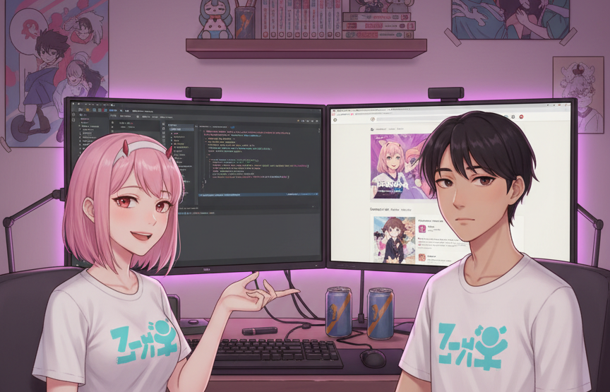

<h1 align="center">It's everything gonna be alright! 🌟</h1>

  
    <a href="https://www.gitanimals.org/en_US?utm_medium=image&utm_source=bondanbanuaji&utm_content=line">
      <!--  -->
      

        
      

    </a>

 

    
        <!--  -->

 

 
  
    
    
    
     
    
    
    
    
    
  

 

  
  
  
  

 

