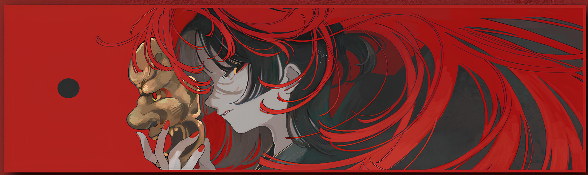

<!-- <h1 align="center">It's everything gonna be alright! 🌟</h1>
&nbsp;&nbsp;&nbsp;

  
    

&nbsp;&nbsp;&nbsp;

  

  

    🟢 Counting every curious soul visiting this page...
  

&nbsp;&nbsp;&nbsp; -->

  

&nbsp;&nbsp;&nbsp; 

<table width="100%" align="center">
<tr>
  <td colspan="8" align="center">
    <a href="https://git.io/typing-svg">
      <picture>
        <source
          media="(prefers-color-scheme: dark)"
          srcset="https://readme-typing-svg.demolab.com?font=JetBrains+Mono&weight=600&pause=1000&color=F7F7F7&center=true&vCenter=true&width=850&lines=Yo+what's+up!+Welcome+to+my+GitHub+profile;Just+a+dev+who's+obsessed+with+anime+and+clean+code;Grinding+code+all+day+binge+watching+anime+all+night;No+cap+I'm+really+vibing+with+this+full+stack+life;Lowkey+addicted+to+coding+and+highkey+love+anime;Been+grinding+this+developer+journey+for+a+minute+now;Catch+me+debugging+at+3AM+with+anime+OST+on+repeat;Straight+up+living+that+weeb+developer+lifestyle;Ngl+coding+hits+different+when+you're+watching+anime;Let's+build+something+fire+together+fam!" />
        <source
          media="(prefers-color-scheme: light)"
          srcset="https://readme-typing-svg.demolab.com?font=JetBrains+Mono&weight=600&pause=1000&color=000000&center=true&vCenter=true&width=850&lines=Yo+what's+up!+Welcome+to+my+GitHub+profile;Just+a+dev+who's+obsessed+with+anime+and+clean+code;Grinding+code+all+day+binge+watching+anime+all+night;No+cap+I'm+really+vibing+with+this+full+stack+life;Lowkey+addicted+to+coding+and+highkey+love+anime;Been+grinding+this+developer+journey+for+a+minute+now;Catch+me+debugging+at+3AM+with+anime+OST+on+repeat;Straight+up+living+that+weeb+developer+lifestyle;Ngl+coding+hits+different+when+you're+watching+anime;Let's+build+something+fire+together+fam!" />
        
      </picture>
    </a>
  </td>
</tr>
  <tr>
    <td colspan="4" align="center">
      <a href="https://github.com/ashutosh00710/github-readme-activity-graph">
        <picture>
          <source
            media="(prefers-color-scheme: dark)"
            srcset="https://github-readme-activity-graph.vercel.app/graph?username=bondanbanuaji&theme=react-dark&hide_border=true&area=true" />
          <source
            media="(prefers-color-scheme: light)"
            srcset="https://github-readme-activity-graph.vercel.app/graph?username=bondanbanuaji&theme=github-light&hide_border=true&area=true" />
          
        </picture>
      </a>
    </td>
    <td colspan="4" align="center">
      <a href="https://github.com/vn7n24fzkq/github-profile-summary-cards">
        <picture>
          <source
            media="(prefers-color-scheme: dark)"
            srcset="https://github-profile-summary-cards.vercel.app/api/cards/stats?username=bondanbanuaji&theme=github_dark" />
          <source
            media="(prefers-color-scheme: light)"
            srcset="https://github-profile-summary-cards.vercel.app/api/cards/stats?username=bondanbanuaji&theme=github" />
          
        </picture>
      </a>
    </td>
  </tr>
  <tr>
    <td colspan="2" align="center">
      <a href="https://github.com/vn7n24fzkq/github-profile-summary-cards">
        <picture>
          <source
            media="(prefers-color-scheme: dark)"
            srcset="https://github-profile-summary-cards-mirror.vercel.app/api/cards/repos-per-language?username=bondanbanuaji&border_color=0000&bg_color=0000&theme=nord_dark" />
          <source
            media="(prefers-color-scheme: light)"
            srcset="https://github-profile-summary-cards-mirror.vercel.app/api/cards/repos-per-language?username=bondanbanuaji&border_color=0000&bg_color=0000&theme=nord_bright" />
          
        </picture>
      </a>
    </td>
    <td colspan="2" align="center">
      <a href="https://github.com/vn7n24fzkq/github-profile-summary-cards">
        <picture>
          <source
            media="(prefers-color-scheme: dark)"
            srcset="https://github-profile-summary-cards-mirror.vercel.app/api/cards/most-commit-language?username=bondanbanuaji&border_color=0000&bg_color=0000&theme=nord_dark" />
          <source
            media="(prefers-color-scheme: light)"
            srcset="https://github-profile-summary-cards-mirror.vercel.app/api/cards/most-commit-language?username=bondanbanuaji&border_color=0000&bg_color=0000&theme=nord_bright" />
          
        </picture>
      </a>
    </td>
    <td colspan="4" align="center">
      

        
      

    </td>
  </tr>
  <tr>
    <td colspan="6" align="center">
      <a href="https://github.com/ryo-ma/github-profile-trophy">
        <picture>
          <source
            media="(prefers-color-scheme: dark)"
            srcset="https://github-trophies.vercel.app/?username=bondanbanuaji&theme=monokai&no-frame=false&no-bg=true&margin-w=6&column=6&row=1" />
          <source
            media="(prefers-color-scheme: light)"
            srcset="https://github-trophies.vercel.app/?username=bondanbanuaji&theme=flat&no-frame=false&no-bg=true&margin-w=6&column=6&row=1" />
          
        </picture>
      </a>
    </td>
  </tr>
</table>

<!-- &nbsp;&nbsp;&nbsp;

  <!-- 

  
    
       
      
      
       
    
    
    
       
    
    
    
    
       
    
    
    
    

     

  
  
  
  

&nbsp;&nbsp;&nbsp;

&nbsp;&nbsp;&nbsp;

  
  &nbsp;&nbsp;&nbsp;
  

 -->